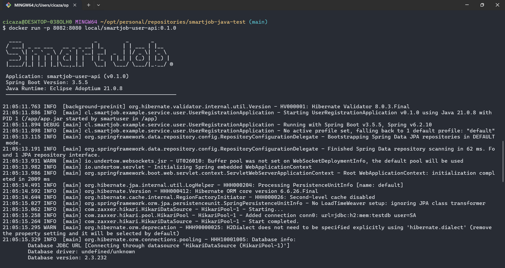
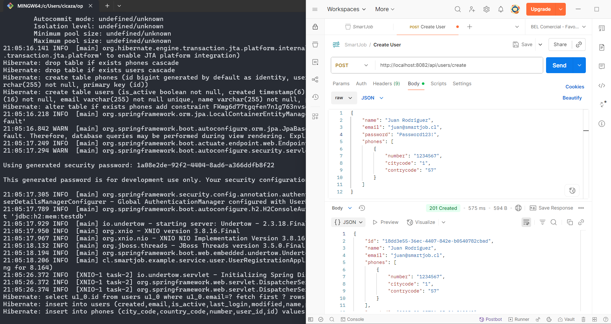
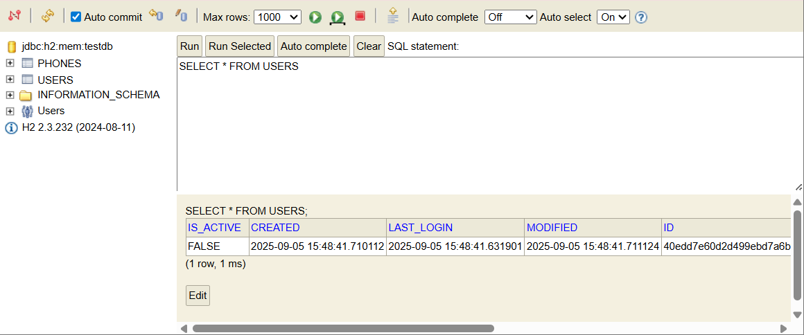
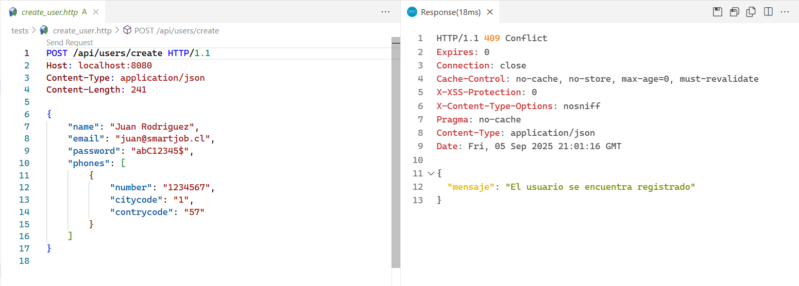
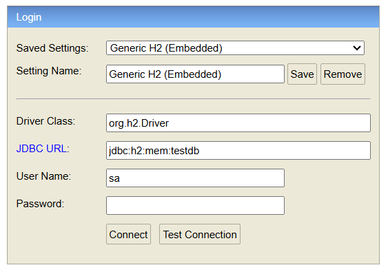

# User Registration API

API RESTful para el registro de usuarios desarrollada con Spring Boot 3.3.5, Java 21 y Gradle 8.14.3.

## Características

- ✅ API RESTful con endpoint de registro de usuarios
- ✅ Validación de formato de correo electrónico (configurable)
- ✅ Validación de formato de contraseña (configurable)
- ✅ Verificación de correos únicos
- ✅ Persistencia con JPA/Hibernate
- ✅ Base de datos H2 en memoria
- ✅ Pruebas unitarias
- ✅ Manejo global de excepciones
- ✅ Respuestas JSON estructuradas

## TODO List
- 📝 Generación de tokens JWT
- 📝 Documentación con Swagger/OpenAPI
- 📝 Incrementar cobertura de código
- 📝 Configurar Gracefull Shutdown
- 📝 Configurar SpringBoot Actuator
- 📝 Configurar trazas distribuidas con OpenTelemetry
- 📝 Optimizar el archivo Dockerfile
- 📝 Configurar Lombok en la capa de persistencia

## Tecnologías Utilizadas

- **Java 21**
- **Spring Boot 3.3.5**
- **Gradle 8.14.3**
- **Spring Data JPA**
- **H2 Database**
- **JUnit 5**
- **Mockito**

## Estructura del Proyecto

```
src/
├── main/
│   ├── java/cl/smartjob/example/service/user/
│   │   ├── config/          # Configuración de seguridad
│   │   ├── controller/      # Controladores REST
│   │   ├── dto/             # Data Transfer Objects
│   │   ├── entity/          # Entidades JPA
│   │   ├── exception/       # Excepciones personalizadas
│   │   ├── mapper/          # Mappers DTO <-> Entity
│   │   ├── repository/      # Repositorios JPA
│   │   ├── service/         # Lógica de negocio
│   │   └── util/            # Utilidades (Validación)
│   └── resources/
│       └── application.yml  # Configuración de la aplicación
└── test/                    # Pruebas unitarias
```

## Configuración

La aplicación utiliza H2 como base de datos en memoria y no requiere configuración adicional para funcionar.

### Configuraciones Personalizables

En `application.yml` puedes configurar:

- **Regex de validación de contraseña**: Por defecto requiere al menos 8 caracteres, una mayúscula, una minúscula, un número y un carácter especial
- **Regex de validación de correo**: Formato estándar de email

## Cómo Ejecutar

### Prerrequisitos

- Java 21
  - La variable de entorno `JAVA_HOME` debe estar configurada
- Gradle 8.14.3
  - o usar el wrapper incluido
- Docker
  - Si desea construir una imagen que contenga la aplicación y ejecutarla en un contenedor

### Pasos

1. **Clonar el repositorio**
```bash
git clone https://github.com/icazacarlos/smartjob-java-test.git
cd smartjob-java-test
```

2. **Compilar y ejecutar**
```bash
gradle bootRun
```

La aplicación estará disponible en `http://localhost:8080`

3. **Docker**

Crear la imagen
```bash
docker build --progress=plain -t local/smartjob-user-api:0.1.0 .
```

Ejecutar el contenedor
```bash
docker run -p 8082:8080 local/smartjob-user-api:0.1.0
```

La aplicación estará disponible en `http://localhost:8082`





### Endpoints Disponibles

- **POST /api/users/create** - Registro de usuarios
- **GET /h2-console** - Consola de base de datos H2

## Cómo Probar

### 1. Usando cURL

```bash
curl -http://localhost:8080/api/users/create \
  -H "Content-Type: application/json" \
  -d '{
    "name": "Juan Rodriguez",
    "email": "juan@rodriguez.org",
    "password": "Password123!",
    "phones": [
      {
        "number": "1234567",
        "citycode": "1",
        "contrycode": "57"
      }
    ]
  }'
```



### Usando un archivo .http

Ejecutar usando el archivo `tests/create_user.http`



Requiere la extensión [REST Client](https://marketplace.visualstudio.com/items?itemName=humao.rest-client)

### 2. Ejecutar Pruebas Unitarias

```bash
gradle test
```

## Respuestas de la API

### Registro Exitoso (201 Created)

```json
{
  "id": "a1b2c3d4-e5f6-7890-abcd-ef1234567890",
  "name": "Juan Rodriguez",
  "email": "juan@rodriguez.org",
  "phones": [
    {
      "number": "1234567",
      "citycode": "1",
      "contrycode": "57"
    }
  ],
  "created": "2024-01-15T10:30:00",
  "modified": "2024-01-15T10:30:00",
  "last_login": "2024-01-15T10:30:00",
  "isactive": false
}
```

### Error - Correo ya registrado (409 Conflict)

```json
{
  "mensaje": "El correo ya registrado"
}
```

### Error - Validación (400 Bad Request)

```json
{
  "mensaje": "La contraseña debe tener al menos 8 caracteres, una mayúscula, una minúscula, un número y un carácter especial"
}
```

## Base de Datos

La aplicación utiliza H2 en memoria. Para inspeccionar la base de datos:

1. Ir a `http://localhost:8080/h2-console`
2. Usar las siguientes credenciales:
   - **JDBC URL**: `jdbc:h2:mem:testdb`
   - **Username**: `sa`
   - **Password**: (vacío)



### Esquema de Base de Datos

```sql
-- Tabla usuarios
CREATE TABLE users (
    id BINARY(16) PRIMARY KEY,
    name VARCHAR(255) NOT NULL,
    email VARCHAR(255) NOT NULL UNIQUE,
    password VARCHAR(255) NOT NULL,
    created TIMESTAMP NOT NULL,
    modified TIMESTAMP NOT NULL,
    last_login TIMESTAMP,
    is_active BOOLEAN NOT NULL DEFAULT TRUE
);

-- Tabla teléfonos
CREATE TABLE phones (
    id BIGINT PRIMARY KEY AUTO_INCREMENT,
    number VARCHAR(50) NOT NULL,
    city_code VARCHAR(10),
    country_code VARCHAR(10),
    user_id BINARY(16),
    FOREIGN KEY (user_id) REFERENCES users(id)
);
```

## Diagrama de la Solución

```
┌─────────────────┐    ┌──────────────────┐    ┌─────────────────┐
│   Client/User   │    │   UserController │    │   UserService   │
└─────────────────┘    └──────────────────┘    └─────────────────┘
         │                       │                       │
         │  POST /api/users/     │                       │
         │      create           │                       │
         │──────────────────────▶│                       │
         │                       │   registerUser()      │
         │                       │──────────────────────▶│
         │                       │                       │
         │                       │                       │ ┌─────────────────┐
         │                       │                       │ │ ValidationUtil  │
         │                       │                       │ └─────────────────┘
         │                       │                       │          │
         │                       │                       │ validate │
         │                       │                       │  email & │
         │                       │                       │ password │
         │                       │                       │◄─────────┘
         │                       │                       │
         │                       │                       │ ┌─────────────────┐
         │                       │                       │ │ UserRepository  │
         │                       │                       │ └─────────────────┘
         │                       │                       │          │
         │                       │                       │ check if │
         │                       │                       │ email    │
         │                       │                       │ exists   │
         │                       │                       │◄─────────┘
         │                       │                       │
         │                       │                       │ ┌─────────────────┐
         │                       │                       │ │PasswordEncoder  │
         │                       │                       │ └─────────────────┘
         │                       │                       │          │
         │                       │                       │ encode   │
         │                       │                       │password  │
         │                       │                       │◄─────────┘
         │                       │                       │
         │                       │                       │ ┌─────────────────┐
         │                       │                       │ │   UserMapper    │
         │                       │                       │ └─────────────────┘
         │                       │                       │          │
         │                       │                       │ DTO to   │
         │                       │                       │ Entity   │
         │                       │                       │◄─────────┘
         │                       │                       │
         │                       │                       │ ┌─────────────────┐
         │                       │                       │ │ UserRepository  │
         │                       │                       │ └─────────────────┘
         │                       │                       │          │
         │                       │                       │  save    │
         │                       │                       │  user    │
         │                       │                       │◄─────────┘
         │                       │                       │
         │                       │                       │ ┌─────────────────┐
         │                       │                       │ │   UserMapper    │
         │                       │                       │ └─────────────────┘
         │                       │                       │          │
         │                       │                       │ Entity   │
         │                       │                       │ to DTO   │
         │                       │                       │◄─────────┘
         │                       │                       │
         │                       │◄──────────────────────│
         │◄──────────────────────│                       │
         │                       │                       │
```

## Validaciones Implementadas

### Email
- Formato estándar de email usando regex
- Verificación de unicidad en base de datos

### Password
- Por defecto: mínimo 8 caracteres
- Al menos una letra mayúscula
- Al menos una letra minúscula  
- Al menos un dígito
- Al menos un carácter especial de la siguiente lista
  - @$!%*?&-

### Campos Requeridos
- Nombre (no puede estar vacío)
- Email (no puede estar vacío)
- Password (no puede estar vacío)
- Lista de teléfonos (no puede ser null)
- Número de teléfono (no puede estar vacío)

## Códigos de Estado HTTP

- **201 Created**: Usuario registrado exitosamente
- **400 Bad Request**: Datos de entrada inválidos o faltan campos requeridos
- **409 Conflict**: El correo electrónico ya está registrado
- **500 Internal Server Error**: Error interno del servidor

## Características de Seguridad

- Contraseñas hasheadas con BCrypt
- Validación de entrada robusta
- Manejo seguro de excepciones

## Desarrollo y Testing

### Ejecutar en modo desarrollo

```bash
gradle bootRun
```

### Ejecutar solo las pruebas

```bash
gradle test
```

### Generar reporte de cobertura

```bash
gradle jacocoTestReport
```

Ubicación del reporte: `build/reports/jacoco/test/html/index.html`

### Construir JAR ejecutable

```bash
gradle build test
```

El JAR se generará en `build/libs/smartjob-java-test-0.1.0.jar`

### Ejecutar JAR

```bash
java -jar build/libs/smartjob-java-test-0.1.0.jar
```
